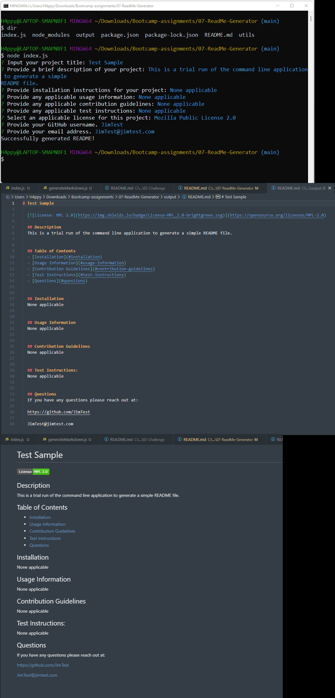

# 07-ReadMe-Generator


## Challenge User Story

```
AS A developer
I WANT a README generator
SO THAT I can quickly create a professional README for a new project
```


## Challenge Acceptance Criteria

```
GIVEN a command-line application that accepts user input
WHEN I am prompted for information about my application repository
THEN a high-quality, professional README.md is generated with the title of my project and sections entitled Description, Table of Contents, Installation, Usage, License, Contributing, Tests, and Questions
WHEN I enter my project title
THEN this is displayed as the title of the README
WHEN I enter a description, installation instructions, usage information, contribution guidelines, and test instructions
THEN this information is added to the sections of the README entitled Description, Installation, Usage, Contributing, and Tests
WHEN I choose a license for my application from a list of options
THEN a badge for that license is added near the top of the README and a notice is added to the section of the README entitled License that explains which license the application is covered under
WHEN I enter my GitHub username
THEN this is added to the section of the README entitled Questions, with a link to my GitHub profile
WHEN I enter my email address
THEN this is added to the section of the README entitled Questions, with instructions on how to reach me with additional questions
WHEN I click on the links in the Table of Contents
THEN I am taken to the corresponding section of the README
```


## My Goal

I will create an application that fulfils the requirements above. The code will make use of the following technology:
* [Node.js](https://nodejs.org/en/docs/) 
* [Inquirer package](https://www.npmjs.com/package/inquirer/v/8.2.4)


## Grading Requirements

This Challenge is graded based on the following criteria: 


### Deliverables:

* A sample README generated using the application must be submitted.
* Your GitHub repository containing your application code.


### Walkthrough Video:

* A walkthrough video that demonstrates the functionality of the README generator must be submitted, and a link to the video should be included in your README file.
* The walkthrough video must demonstrate how a user would invoke the application from the command line.
* The walkthrough video must demonstrate how a user would enter responses to all of the prompts in the application.
* The walkthrough video must demonstrate a generated README that matches the user input and has a functioning table of contents.


### Technical Acceptance Criteria:

* Satisfies all of the above acceptance criteria plus the following:
	* Uses the [Inquirer package](https://www.npmjs.com/package/inquirer/v/8.2.4).


### Repository Quality:

* Repository has a unique name.
* Repository follows best practices for file structure and naming conventions.
* Repository follows best practices for class/id naming conventions, indentation, quality comments, etc.
* Repository contains multiple descriptive commit messages.
* Repository contains a high-quality README with description and a link to walkthrough video.


## Review

You are required to submit the following for review:

* A walkthrough video demonstrating the functionality of the application.
* A sample README.md file for a project repository generated using your application
* The URL of the GitHub repository, with a unique name and a README describing the project


## Application Screenshot

The following image shows the web application's appearance and functionality:



The following video demonstrates the application's functionality:


